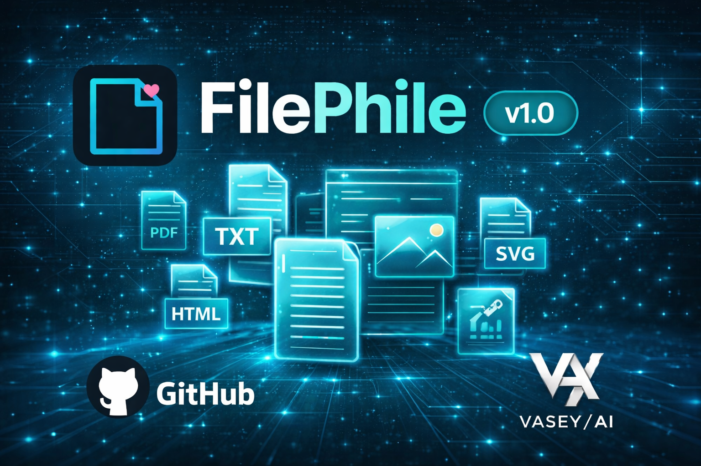

<div align="center">



# FilePhile v1.1

**Premium, single-page file generation studio**

Create and download text-based files instantly with powerful features and a beautiful interface.

[](https://github.com/SeanVasey/FilePhile/actions/workflows/ci.yml)
[](https://github.com/SeanVasey/FilePhile/actions/workflows/deploy-pages.yml)
[](https://github.com/SeanVasey/FilePhile)
[](LICENSE)
[](docs/SECURITY_REVIEW.md)
[](docs/PWA_SETUP.md)
[](https://github.com/SeanVasey/FilePhile)

[Features](#-features) · [Tech Stack](#-tech-stack) · [Getting Started](#-getting-started) · [Deployment](#-deployment) · [Usage](#-usage) · [Security](#-security) · [Contributing](#-contributing)

</div>

---

## Features

- **Multiple Format Presets** — `.txt`, `.md`, `.html`, `.json`, `.svg`, and custom extensions
- **Syntax Highlighting** — Auto-detection for HTML, SVG, JSON, and Markdown
- **Find & Replace** — Regex support with match navigation
- **Undo/Redo** — Full edit history with 50-level undo stack
- **Drag & Drop** — File import with size and extension validation
- **Zen Mode** — Distraction-free editing experience
- **Line Numbers** — Optional line numbering with current line highlight
- **Word Wrap** — Toggle word wrapping for long lines
- **Adjustable Font Size** — Customize editor font size
- **Keyboard Shortcuts** — Complete keyboard navigation
- **Print Support** — Optimized print styles
- **Auto-Save** — LocalStorage persistence across sessions
- **Live Statistics** — Character, word, and line counts
- **Dark/Light Theme** — Glassmorphism UI with theme toggle
- **Security First** — Comprehensive XSS protection, CSP, input validation
- **PWA Ready** — Install as a native-like app, works offline

---

## Tech Stack

| Layer | Technology |
|-------|-----------|
| **Language** | Vanilla JavaScript (ES6+) |
| **Styling** | Pure CSS3 with custom properties for theming |
| **Fonts** | [Outfit](https://fonts.google.com/specimen/Outfit) (UI) + [JetBrains Mono](https://fonts.google.com/specimen/JetBrains+Mono) (editor) |
| **PWA** | Service Worker with cache-first strategy |
| **Persistence** | LocalStorage |
| **Build** | None — zero dependencies, no bundler |
| **CI/CD** | GitHub Actions (validation + GitHub Pages deploy) |
| **Hosting** | GitHub Pages, Vercel, or any static host |

---

## Getting Started

FilePhile requires **no build step**. Open `index.html` directly:

```bash
open index.html          # macOS
xdg-open index.html      # Linux
start index.html         # Windows
```

Or **double-click** the file to launch in your default browser.

### Local Development Server

For Service Worker and PWA features, use a local server:

```bash
python3 -m http.server 8000
# or
npx serve .
```

Then open `http://localhost:8000`.

### Install as PWA

See the full [PWA Setup Guide](docs/PWA_SETUP.md).

- **iOS:** Safari → Share → Add to Home Screen
- **Android:** Chrome → Menu → Install App
- **Desktop:** Chrome/Edge → address bar install icon

---

## Deployment

### GitHub Pages

Automated via GitHub Actions. On every push to `main`, the site deploys to GitHub Pages.

1. Go to **Settings → Pages** in your repository
2. Under **Source**, select **GitHub Actions**
3. Pushes to `main` auto-deploy via the `deploy-pages.yml` workflow

Live at: `https://<username>.github.io/FilePhile/`

### Vercel

A `vercel.json` is included with security headers and caching rules.

1. Import the repository at [vercel.com/new](https://vercel.com/new)
2. Framework Preset: **Other**
3. Build Command: *(leave empty)*
4. Output Directory: `.`
5. Deploy

Provides: security headers, service worker cache-control, long-term caching for icons, clean URL routing.

### Any Static Host

Upload all files to any static host (Netlify, S3, Cloudflare Pages, Firebase Hosting, etc.). No server-side processing required.

---

## Usage

### Keyboard Shortcuts

| Action | Shortcut |
|--------|----------|
| Download | `Ctrl+S` |
| Copy Text | `Ctrl+Shift+C` |
| Open File | `Ctrl+O` |
| Find/Replace | `Ctrl+F` |
| Preview HTML/SVG | `Ctrl+P` |
| Line Numbers | `Ctrl+L` |
| Word Wrap | `Alt+Z` |
| Clear Editor | `Ctrl+Shift+X` |
| Undo / Redo | `Ctrl+Z` / `Ctrl+Y` |
| Help | `?` |

### Supported File Types

**Built-in Presets:** `.txt`, `.md`, `.html`, `.json`, `.svg`

**Custom Extensions:** 40+ file types including `.js`, `.ts`, `.py`, `.css`, `.xml`, `.yml`, `.sql`, `.php`, `.rb`, `.go`, `.rs`, `.java`, `.c`, `.cpp`, `.swift`, `.kt`, and more.

### Editor Features

- **Auto-Indentation** — Smart indentation on Enter
- **Auto-Pairing** — Brackets, quotes, and parentheses
- **Tab Support** — Tab key inserts 2 spaces
- **Scroll Sync** — Line numbers sync with editor scroll
- **Regex Search** — Find with regex support and match highlighting

---

## Architecture

FilePhile is intentionally built as a **single HTML file** (~1,490 lines):

- **Easy Deployment** — Drop anywhere, no build process
- **Offline Use** — Works without internet after initial load
- **Portability** — Share a single file
- **Zero Dependencies** — No npm packages or external scripts

All code lives in `index.html`:
- Lines 48–300: CSS (styles, themes, animations, responsive)
- Lines 302–472: HTML structure (editor, toolbar, panels, modals)
- Lines 474–1475: JavaScript (IIFE, state management, all logic)
- Lines 1478–1491: Service Worker registration

---

## Security

FilePhile has been security audited. See [SECURITY.md](SECURITY.md) for reporting policy and [SECURITY_REVIEW.md](docs/SECURITY_REVIEW.md) for the full audit.

- **Content Security Policy** — Strict CSP with no `unsafe-eval`
- **XSS Protection** — Detection of 9 attack vectors with user warning
- **Input Sanitization** — Path traversal protection, dangerous character filtering
- **File Validation** — Size limits (10MB upload, 5MB content), extension whitelist
- **Rate Limiting** — Download rate limiting to prevent abuse
- **Privacy** — No-referrer policy on external resources
- **Safe Preview** — Warning system for dangerous HTML content

See [SECURITY_ENHANCEMENTS_SUMMARY.md](docs/SECURITY_ENHANCEMENTS_SUMMARY.md) for enhancement details.

---

## Versioning

Current version: **v1.1**. Version identifiers are maintained in three locations:

| Location | Key |
|----------|-----|
| `index.html` | `VERSION` constant in JavaScript |
| `manifest.webmanifest` | `version` field |
| `sw.js` | Cache name (`filephile-v1.7`) |

Update all three files when releasing a new version. Changing the service worker cache name triggers cache invalidation on existing installs.

---

## Project Structure

```
FilePhile/
├── index.html              # Complete application (single-page)
├── sw.js                   # Service Worker for offline support
├── manifest.webmanifest    # PWA manifest
├── vercel.json             # Vercel deployment config
├── favicon.ico             # Favicon
├── browserconfig.xml       # Windows tile configuration
├── cover.png               # Marketing banner
├── CLAUDE.md               # Development guide & standards
├── CHANGELOG.md            # Version history (Keep a Changelog)
├── SECURITY.md             # Vulnerability reporting policy
├── LICENSE                 # Apache 2.0
├── .editorconfig           # Editor settings
├── .gitignore              # Ignore patterns
├── icons/
│   ├── FilePhile-official.svg
│   ├── icon-{72,144,192,384,512}.png
│   ├── icon-512-maskable.png
│   └── apple-touch-icon.png
├── .github/workflows/
│   ├── ci.yml              # Validation & testing
│   └── deploy-pages.yml    # GitHub Pages deployment
├── docs/
│   ├── PWA_SETUP.md
│   ├── SECURITY_REVIEW.md
│   └── SECURITY_ENHANCEMENTS_SUMMARY.md
└── tasks/
    ├── todo.md             # Active task plan
    └── lessons.md          # Accumulated patterns
```

---

## CI / CD

The CI pipeline (`.github/workflows/ci.yml`) runs on every push and PR to `main`:

- **HTML Structure** — DOCTYPE, meta tags, lang attribute validation
- **Security Checks** — CSP validation, no `unsafe-eval`, referrer policy, innerHTML audit
- **PWA Assets** — Manifest JSON validity, service worker, icons present
- **Version Consistency** — Cross-checks version across HTML, manifest, and service worker
- **File Size** — Ensures `index.html` stays under 200KB
- **JavaScript Syntax** — Validates all inline script blocks parse correctly

Deployment to GitHub Pages is automated via `deploy-pages.yml` on push to `main`.

---

## Contributing

Contributions are welcome! Please ensure:

1. **Security First** — Run security checks for any new features
2. **Test Thoroughly** — Verify all functionality works
3. **Document Changes** — Update README, CHANGELOG, and inline comments
4. **Follow Style** — Match existing code style and conventions
5. **Conventional Commits** — Use `feat:`, `fix:`, `docs:`, `chore:`, etc.

---

## License

Apache License 2.0 — see [LICENSE](LICENSE) for details.

---

## Acknowledgments

- **Design** — Modern glassmorphism UI with dark/light themes
- **Fonts** — [Google Fonts](https://fonts.google.com/) (Outfit, JetBrains Mono)
- **Icons** — Custom SVG icons

---

<div align="center">

**Built with care by [VASEY/AI](https://github.com/SeanVasey)**

[Star on GitHub](https://github.com/SeanVasey/FilePhile) · [Report Bug](https://github.com/SeanVasey/FilePhile/issues) · [Request Feature](https://github.com/SeanVasey/FilePhile/issues)

</div>
